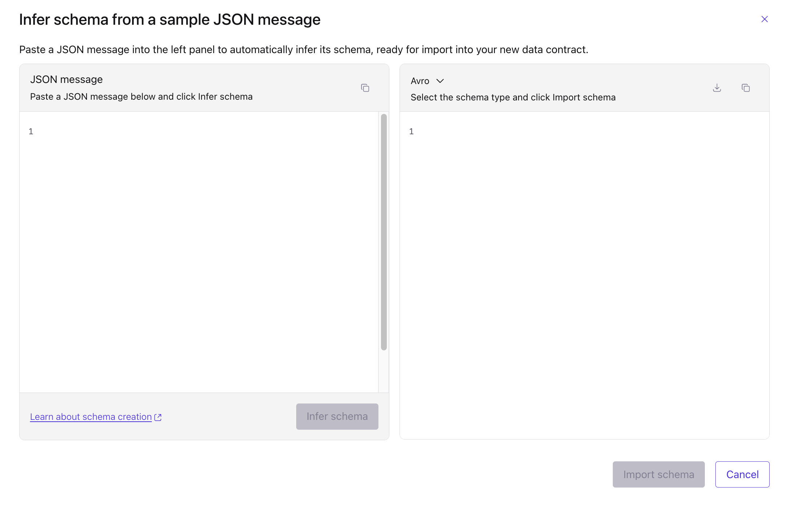
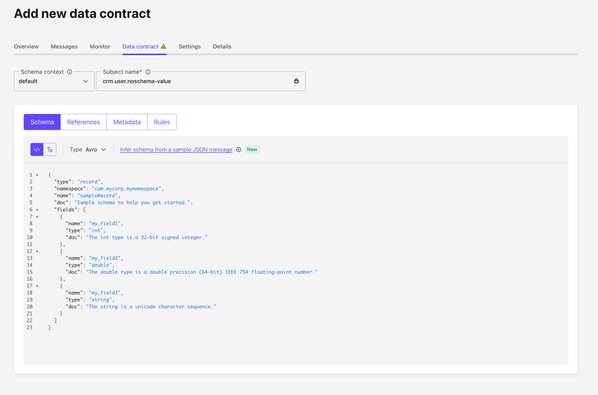

# Scenario C: Schemaless (Raw JSON)

This scenario explores the "Schema-on-read" approach, where data is produced as raw JSON strings without the enforcement or governance of a Schema Registry at production time.

## Overview

In this setup, the topic `crm.user.noschema` acts as a landing zone for unstructured or semi-structured data. Governance is managed externaly by thrid system or via manaul communication.

We will demonstrate:

1. **Raw Ingestion**: Producing JSON payloads that do not reference any schema ID.
2. **Schema Inference**: How infer schema for Flink or TableFlow.
3. **Runtime Filtering**: Routing records to `adults` or `dlq` topics based on field values extracted during processing.

---

## 1. Produce Schemaless Data

```bash
printf '%s\n' \
  '{"firstName":"No","lastName":"Schema","fullName":"","age":38,"id":null,"nombre":null,"email":null,"edad":null}' | \
  docker run --rm -i \
    -v "$TERRAFORM_CLIENT_PROPERTIES:/work/client.properties:ro" \
    "$DEMO_KAFKA_SERVER_IMAGE" \
    kafka-console-producer \
      --bootstrap-server "$BOOTSTRAP_SERVER" \
      --producer.config /work/client.properties \
      --topic crm.user.noschema
```

## 2. Consume raw strings from `crm.user.noschema`

```bash
docker run --rm -i \
  -v "$TERRAFORM_CLIENT_PROPERTIES:/work/client.properties:ro" \
  "$DEMO_KAFKA_SERVER_IMAGE" \
  kafka-console-consumer \
    --bootstrap-server "$BOOTSTRAP_SERVER" \
    --consumer.config /work/client.properties \
    --topic crm.user.noschema \
    --from-beginning \
    --max-messages 10
```

## 3. Schemaless topic: infer schema + Flink filtering (mandatory section)

### 3.1 Infer schema from messages

1. Navigate to Confluent Cloud UI.
2. Go to your environment.
3. Navigate to your kafka cluster.
4. Navigate to the Topics `crm.user.noschema`.
5. Navigate to `Data contract`.
6. Create a new `Data contract`. Click on `Infer schema from a sample JSON message`.



7. Paste the sample schema from the [file](./terraform/06-flink/default_sceham.json).
   



### 3.2 Provision Flink and deploy statements via Terraform
```bash
# 1) Infrastructure prerequisites (compute pool, RBAC, Flink API key)
terraform -chdir=terraform/06-flink/01-infra init
terraform -chdir=terraform/06-flink/01-infra apply
```

### 3.3 Provision Flink and deploy statements via Terraform
```bash
# 1) Infrastructure prerequisites (compute pool, RBAC, Flink API key)
terraform -chdir=terraform/06-flink/02-application init
terraform -chdir=terraform/06-flink/02-application apply
```

Expected behavior:
- Messages with `age >= 18` are written to `crm.user.noschema.adults`.
- Messages with `age < 18` are written to `crm.user.noschema.dlq`.